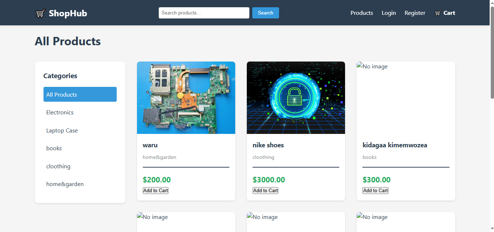
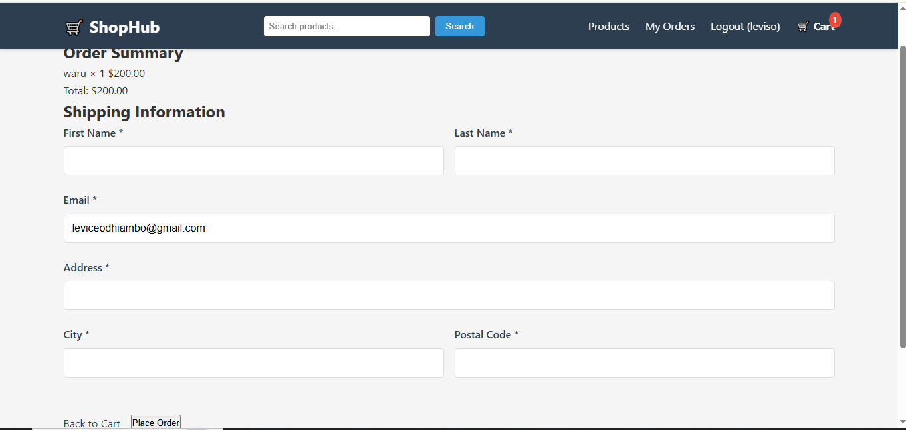
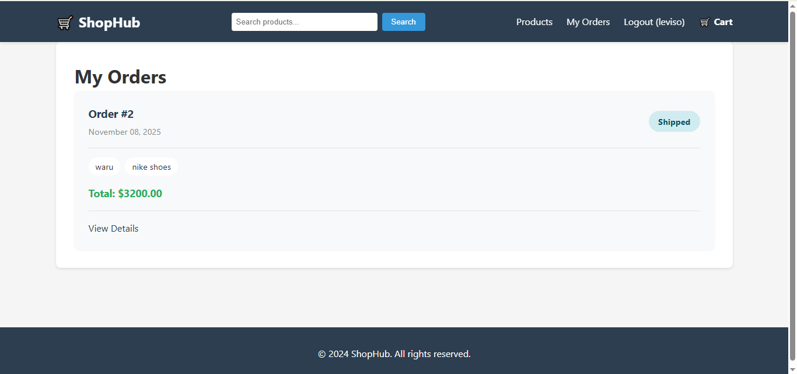

# ShopHub - Django E-Commerce Application

A full-featured e-commerce web application built with Django, featuring product catalogs, shopping cart, user authentication, and order management.


## Features

### Customer Features
-  **Product Catalog**: Browse products by categories
-  **Search**: Find products by name or description
-  **Shopping Cart**: Add, update, and remove items
-  **User Authentication**: Register, login, and manage account
-  **Order Management**: Place orders and track order history
-  **Responsive Design**: Works on desktop, tablet, and mobile

### Admin Features
-  **Dashboard**: Manage products, categories, and orders
- **Image Upload**: Add product images
-  **Inventory Management**: Track stock levels
-  **Order Processing**: Update order status and payment status
-  **User Management**: View and manage customers

### Technical Features
-  **Session-based Cart**: Cart persists for anonymous users
-  **Database-backed Storage**: All data stored in SQLite/PostgreSQL
-  **Modern UI**: Clean and intuitive interface
-  **Fast Performance**: Optimized queries and caching
-  **Security**: CSRF protection, secure authentication

##  Screenshots

### Home Page
Browse all products with category filtering.


### Product Detail
View detailed product information with add to cart functionality.

### Shopping Cart
Review items, update quantities, and proceed to checkout.

### Order History
Track all your orders in one place.


##  Tech Stack

- **Backend**: Django 4.2+
- **Database**: SQLite (Development) / PostgreSQL (Production)
- **Frontend**: HTML5, CSS3, JavaScript
- **Image Processing**: Pillow
- **Authentication**: Django Auth System
- **Session Management**: Django Sessions

##  Installation

### Prerequisites

- Python 3.8 or higher
- pip (Python package manager)
- Virtual environment (recommended)

### Step 1: Clone the Repository

```bash
git https://github.com/dalyzhee/Ecommerce-Django.git
cd Ecommerce-Django
```

### Step 2: Create Virtual Environment

```bash
# Windows
python -m venv venv
venv\Scripts\activate

# Mac/Linux
python3 -m venv venv
source venv/bin/activate
```

### Step 3: Install Dependencies

```bash
pip install django pillow
```

Or if you have a requirements.txt:

```bash
pip install -r requirements.txt
```

### Step 4: Configure Database

```bash
# Run migrations
python manage.py makemigrations
python manage.py migrate
```

### Step 5: Create Superuser

```bash
python manage.py createsuperuser
```

Follow the prompts to create an admin account.

### Step 6: Create Required Directories

```bash
# Windows
mkdir media
mkdir static\images

# Mac/Linux
mkdir -p media
mkdir -p static/images
```

### Step 7: Run Development Server

```bash
python manage.py runserver
```

Visit `http://127.0.0.1:8000/` in your browser.


